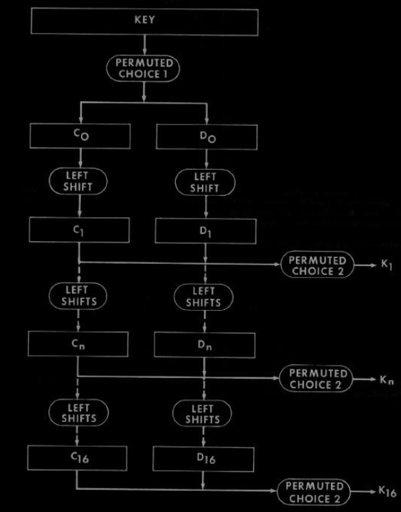
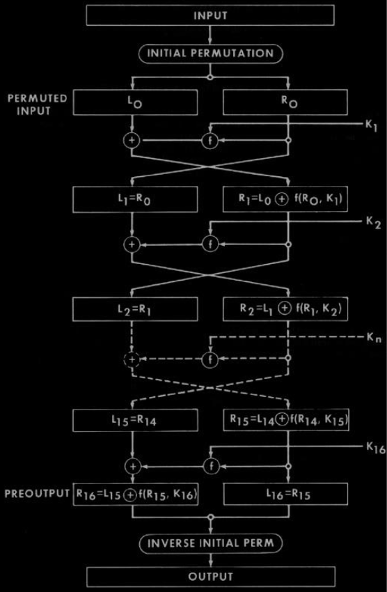

# DES Implementation

This is a Python implementation of the Data Encryption Standard (DES) algorithm. DES is a symmetric key block cipher that was widely used for secure data encryption in the past. It operates on 64-bit blocks of data and uses a 56-bit key for encryption and decryption.

## What is DES?

The Data Encryption Standard (DES) is a symmetric-key algorithm for data encryption. It was widely adopted as a standard for data encryption and is known for its block cipher design. DES is based on a Feistel network, which iteratively processes data in a series of rounds. Each round involves a combination of permutation and substitution operations.

## Key Generation

The key generation process is a crucial part of the DES algorithm. It takes a 64-bit key (although only 56 bits are used) and generates 16 subkeys, one for each round of the algorithm. These subkeys are derived through a series of permutations and shifts from the original key.

<div style="text-align:center">
  
</div>

## Encryption

To encrypt data using DES, you need a 64-bit plaintext and a 56-bit key. The plaintext is processed through 16 rounds of permutation, substitution, and XOR operations using the generated subkeys. The result is the ciphertext, which is also 64 bits long.


<div style="text-align:center">
  
</div>

## Decryption

Decryption in DES is essentially the reverse process of encryption. The ciphertext is processed through the same 16 rounds, but the subkeys are applied in reverse order. This process effectively reverses the encryption, producing the original plaintext.

## Usage

You can use this DES implementation in your Python projects by importing the `DES` class.

```python

from DES import DES

def main():

    plaintext="5AFE"*4
    key="C0DE"*4
    #plaintext="1111000011110000111100001111000011110000111100001111000011110000"
    #key="0001001100110100010101110110101110011011101111111111111111110001"
    #with open("plaintext.txt","r") as f:
     #   plaintext=f.read()
    #with open("key.txt","r") as f:
        #   key=f.read()
    ciphertext=DES.encript(plaintext,key)
    print("ciphertext:",ciphertext)
    print("plaintext:",DES.decript(ciphertext,key))

if __name__ == "__main__":
    main()
